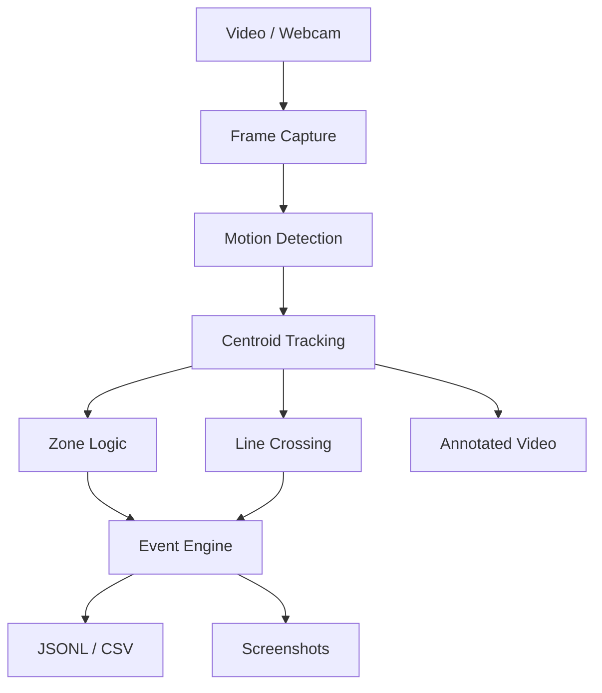
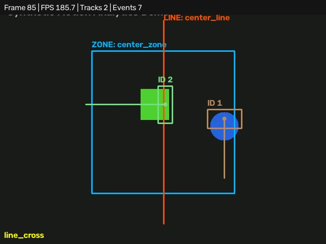

# OpenCV Event Tracker

A production-style, configuration-driven video analytics MVP that detects motion, assigns stable object IDs, monitors regions and virtual lines, and produces reviewable evidence. It accepts video files or cameras and runs headlessly by default.

> This MVP detects **moving foreground blobs**, not people, vehicles, faces, or other semantic classes. It includes no facial recognition and requires no model downloads.

## Features

- OpenCV MOG2 foreground detection with configurable filtering and morphology
- Centroid/nearest-neighbor tracking with trajectories and missing-frame tolerance
- Multiple rectangular zones with enter and exit events
- Multiple directed virtual lines with deduplicated crossing events
- JSONL event records, optional CSV, annotated MP4, and event screenshots
- File and webcam input, optional preview, safe non-overwriting output directories
- Deterministic synthetic demo and headless end-to-end pytest coverage



## Installation

Python 3.11 or newer is required.

```bash
python -m venv .venv
# Windows: .venv\Scripts\activate
# Linux/macOS: source .venv/bin/activate
python -m pip install -e ".[dev]"
```

The default dependency is `opencv-python-headless`, so servers and CI do not need GUI libraries. To use `--display`, replace it with `opencv-python` in your local environment.

## Quick start

Generate a copyright-free 640×480 demo, validate its matching configuration, and process it:

```bash
python scripts/generate_demo_video.py
opencv-event-tracker validate-config --config examples/demo.yaml
opencv-event-tracker inspect --input examples/demo.mp4
opencv-event-tracker run --input examples/demo.mp4 --config examples/demo.yaml
```

Camera use and useful overrides:

```bash
opencv-event-tracker run --camera 0 --display
opencv-event-tracker run --input clip.mp4 --output output/review --no-video --max-frames 300
```

Press `q` to close an enabled preview. `--input` and `--camera` are mutually exclusive. Missing/unreadable sources and invalid configurations produce concise errors and a non-zero exit code.

## Configuration and pipeline

Both [`config.example.yaml`](config.example.yaml) and [`examples/demo.yaml`](examples/demo.yaml) document every setting. Coordinates use absolute source pixels; this keeps overlays exact and easy to tune for a fixed camera. Each zone uses `(x1, y1)` through `(x2, y2)`, and each line uses two endpoints.

Detection uses MOG2 background subtraction, removes shadows with a binary threshold, applies opening/dilation, then filters contours by area. Motion blobs can merge when objects overlap. Tracking greedily associates nearest centroids within `max_distance`, retains unmatched tracks for `max_missing_frames`, and never labels their semantic contents.

Zone membership is based on the tracked centroid. Transitions generate `zone_enter` and `zone_exit`. A sign change across a directed line generates `line_cross` with `positive_to_negative` or `negative_to_positive`. Cooldown keys combine object ID, event type, and zone/line name, preventing repeated noise without suppressing unrelated events.

Events include a UUID, UTC timestamp, frame, object ID, source, bounding box, centroid, and relevant context. Implemented types are `object_detected`, `zone_enter`, `zone_exit`, `line_cross`, and `object_lost`.

## Output

Each run creates the configured directory, or a numbered sibling such as `demo-001` if it already exists:

```text
output/demo/
├── annotated.mp4
├── events.csv
├── events.jsonl
└── screenshots/
    ├── ..._zone_enter_object_1.jpg
    └── ..._line_cross_object_1.jpg
```

The video shows boxes, stable IDs, centroids, trajectory trails, configured geometry, measured processing FPS, frame count, event count, and recent event activity. Screenshots are captured from these annotated frames.

## Demo artifacts



The preview and [`docs/demo-events.json`](docs/demo-events.json) are exported from an actual deterministic application run with `python scripts/export_demo_artifacts.py`; they are not hand-authored fixtures.

## Testing and quality

```bash
ruff check .
ruff format --check .
pytest
```

The suite covers YAML validation, centroid geometry, ID persistence and disappearance, zones, line direction, cooldown behavior, JSONL output, invalid input, and a full generated-video run. CI performs the same checks without a webcam.

## Project structure

```text
src/opencv_event_tracker/
├── app.py          # pipeline orchestration and statistics
├── cli.py          # run, inspect, validate-config
├── config.py       # typed YAML settings and validation
├── detection.py    # foreground/motion blobs
├── events.py       # transitions and cooldown
├── models.py       # detections, tracks, events
├── output.py       # logs, screenshots, overlays
├── tracking.py     # centroid association
├── video.py        # capture/writer validation
└── zones.py        # spatial geometry
```

## Limitations and next steps

Camera motion, illumination changes, shadows, and overlapping objects can degrade foreground segmentation and ID stability. Absolute coordinates must be updated for a different resolution. The lightweight tracker does not use appearance features or motion prediction. Logical next milestones are normalized geometry, perspective-aware zones, Kalman/Hungarian association, an optional pluggable semantic detector, and a small web review UI.

This project uses only generated geometric footage for its demo. Do not commit webcam recordings or footage containing personal information.
